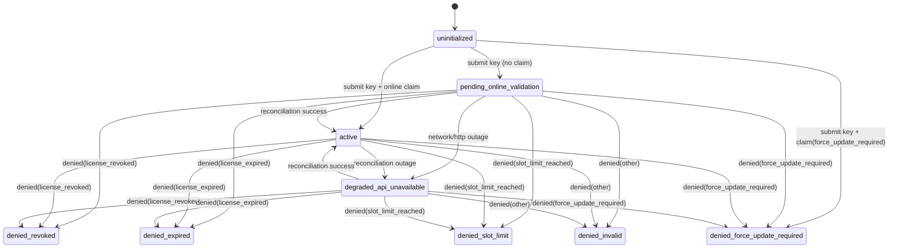

# Desktop Activation State Machine (Sprint 6)

## Overview

Desktop activation is implemented as a policy-driven local state machine backed by `app_settings` (`product.license_onboarding` / `device` scope) and reconciled against the control-plane activation API.

Local state is never treated as permanently authoritative: activation continuity can degrade offline, but successful operation must eventually pass online reconciliation.

## State Diagram

## Reconciliation Policy

- Scheduler triggers every 30s when app is online.
- Reconciliation is attempted when:
  - state is `pending_online_validation` or `degraded_api_unavailable`, and
  - `next_retry_at` is due (or immediate if unset).
- Backoff policy:
  - starts at 30s,
  - exponential growth (`30s * 2^attempt`),
  - capped at 6h.

## Deny / Degraded Matrix

- `denied_revoked`: hard block; operator support required.
- `denied_expired`: hard block; renewal required.
- `denied_slot_limit`: hard block; machine slot reassignment required.
- `denied_force_update_required`: hard block; update client first.
- `denied_invalid`: hard block; generic control-plane denial.
- `degraded_api_unavailable`: continuity allowed with warning + scheduled retries.

## Diagnostics

Desktop stores activation diagnostics with:

- `status`, `deny_reason_code`, `deny_message`
- `retry_attempt`, `next_retry_at`, `last_attempt_at`, `last_success_at`
- bounded diagnostic event log (latest 64 events)

UI exposes operator-facing diagnostics panel on gate screen:

- connectivity state
- last reconciliation timestamps
- retry timing
- latest error code/message
- recent diagnostic events

## Current Guardrail

`license_key_plaintext` is currently stored to support eventual reconciliation across restarts.
This is a transitional implementation and should migrate to OS keychain-backed secret storage.
